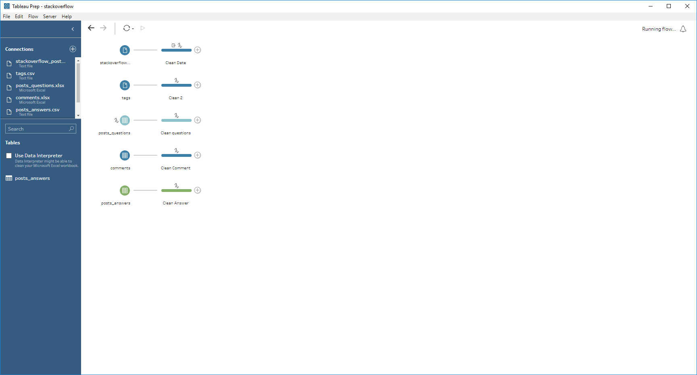

# ETL Process

According to [Stackoverflow Dataset](https://www.kaggle.com/stackoverflow/stackoverflow), we can use BigQuery API to get data. Stackoverflow's data is bigdata, we might not be able to process all data, so limit is provided to limit rows will be fetched. [read_stackoverlow.py](./read_stackoverflow.py) will read data into a folder by given limit.

Pre-processing includes

* Import data to Tableau Prep, change all date time type and remove most of null value
* Convert id as string
* Split tags into multiple keywords
* Group posts by different keywords

Analysis

* Top 100 tag
* Top 10 tag mean, median, mode by year(2008 to 2018)
* All tags's mean, median, mode by numbers
* Top 10 tag Quartiles
* Top 5 tag's correlation
